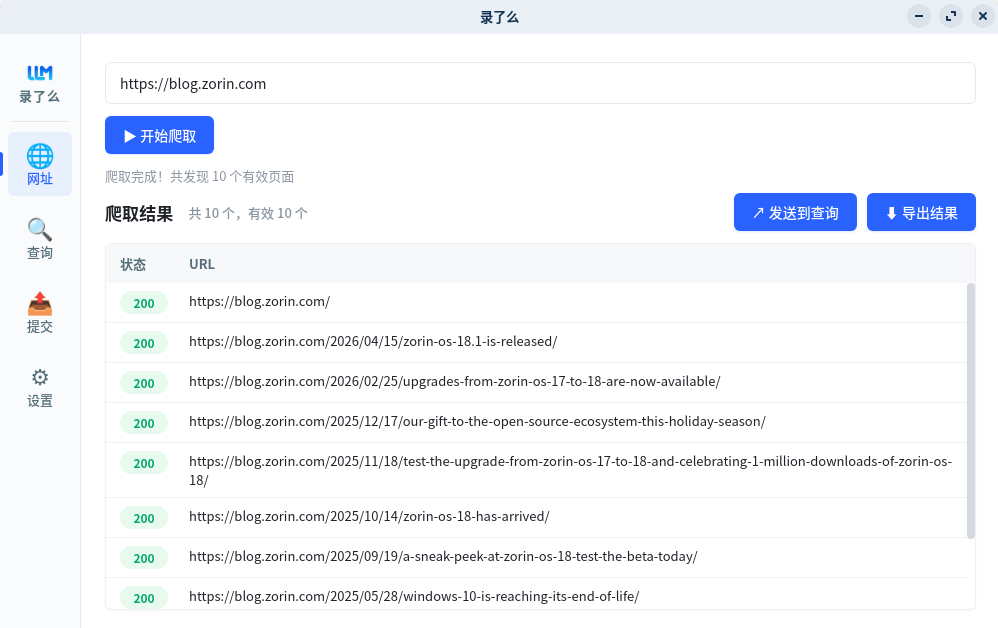
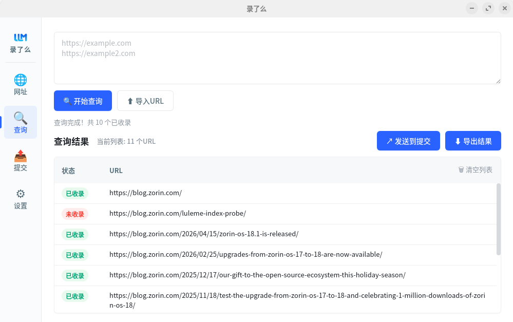

# 录了么

网址收录批量查询、提交工具。跨平台桌面应用（Linux / macOS / Windows），一站式完成「爬取站内 URL → 批量查 Bing 收录 → IndexNow 推送未收录页面」。

## 界面预览

### 网址爬取



### 收录查询



## 功能

- **网址爬取**：输入站点首页，自动爬取同域名内页（最多 500 页），动态页面自动启用浏览器渲染；结果可一键发送到查询页，也可导出。
- **收录查询**：批量查询 URL 在 Bing 的收录状态（已收录 / 未收录 / 查询失败）；已收录行再次查询自动跳过，未收录行可一键发送到提交页；支持导入 / 导出。
- **快速提交**：通过 IndexNow 协议向 Bing 推送 URL，按 host 分组、单批最多 10,000 条，超出自动分批；触发限流（429）按服务器要求退避重试；已成功行再次提交自动跳过。

典型工作流：**爬取 → 查询 → 提交**，三个页面之间可一键流转 URL，无需手动复制。

## 下载安装

前往 GitHub Releases 页下载对应系统安装包（打 `v*` 标签自动构建三平台产物）：

- Windows：`luleme-*-windows-amd64-installer.exe`
- Ubuntu / Debian：`luleme-*_amd64.deb`
- Linux：`luleme-*_linux-amd64`
- macOS：`luleme-*-macos-arm64.zip`

## 本地开发

环境要求：Go 1.22+、Node 20+、Wails v2.9.1。

```bash
# 开发运行
wails dev

# 后端编译检查
go build ./...

# 后端测试
go test ./internal/engines/

# 打包构建
wails build
```

## 技术栈

- 后端：Go + Wails v2
- 前端：Vue 3 + TypeScript + Vite + Pinia + Vue Router
- 查询引擎：Bing（可扩展）
- 提交协议：IndexNow

## 许可证

MIT
